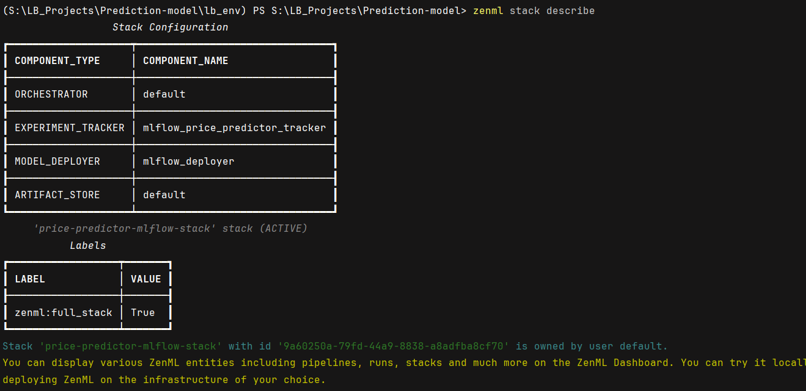

# Prediction-model


### 1. Installation and setup

Install ZenML - https://docs.zenml.io/getting-started/installation

Once virtualenv environment is activated, run following command:
pip install -r requirements.txt

If you are running the run_deployment.py script, you will also need to install some
integrations using ZenML:

```
zenml integration install mlflow -y
```

The project can only be executed with a ZenML stack that has an MLflow experiment
tracker and model deployer as a component. Configuring a new stack with the two
components are as follows:

```commandline

zenml integration install mlflow -y

zenml experiment-tracker register mlflow_price_predictor_tracker --flavor=mlflow

zenml model-deployer register mlflow_deployer --flavor=mlflow
 
zenml stack register price-predictor-mlflow-stack -a default -o default -d mlflow_deployer -e mlflow_price_predictor_tracker --set

```

**Verification**

You can run the below command for verification that it works properly.

```commandline
zenml stack describe
```

The output of above command should look like image below:
